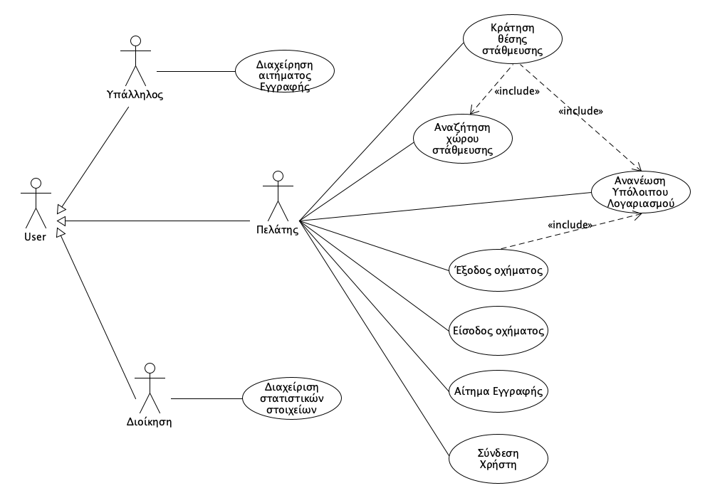
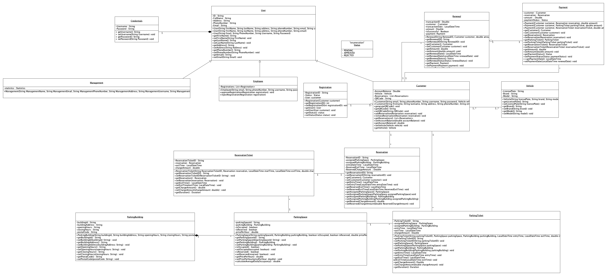

# Εισαγωγή

Το παρόν έγγραφο αφορά το παραδοτέο R2 και αναφέρεται στις απαιτήσεις του λογισμικού με μια ανάλυση συστήματος. Βρίσκονται κατάλληλοι σύνδεσμοι που οδηγούν στην περιγραφή της κάθε περίπτωσης χρήσης ξεχωριστά με τα αντίστοιχα διαγράμματα δραστηριότητας και διαγράμματα ακολουθίας. Επίσης περιέχει συμπληρωματικές προδιαγραφές για τις μη λειτουργικές απαιτήσεις καθώς και το μοντέλο πεδίου που περιλαμβάνει τις βασικές κλάσεις του πεδίου προβλήματος.

<!--## Εμβέλεια

\[*Περιγράφουμε τι θα κάνει και κυρίως τι δεν θα κάνει το λογισμικό. Βλέπε παράδειγμα 3-2 του βιβλίου στη σελίδα 139.*

*Ένα διάγραμμα περιβάλλοντος (πρωταρχικό διάγραμμα ροής δεδομένων) που βοηθά στην κατανόηση του συστήματος σε σχέση με το περιβάλλον του. Βλέπε το σχήμα 4-12 του παραδείγματος 4-1 στη σελίδα 185 του βιβλίου*\]

## Ορισμοί ακρώνυμα και συντομογραφίες

\[*Ένας πίνακας ακρωνύμων και συντομογραφιών που χρησιμοποιούνται στο έγγραφο. Ένας δεύτερος πίνακας με ορισμούς. Οι ορισμοί λαμβάνονται από το γλωσσάρι αν αυτό υπάρχει. Βλέπε πίνακα 3-5 του παραδείγματος 3-1 στη σελίδα 134.*\]

## Αναφορές

\[*Γράφουμε αν υπάρχουμε αναφορές σε άλλα έγγραφα (μελέτη σκοπιμότητας, ΕΠΑΣ, επιχειρησιακά μοντέλα κλπ). Σε περίπτωση που κάποια πληροφορία περιλαμβάνεται σε άλλο έγγραφο γίνεται η αναφορά στο άλλο έγγραφο και δεν επαναλαμβάνεται στο ΕΠΑΛ).*\]

## Επισκόπηση

\[*Γράφουμε πως οργανώνεται το υπόλοιπο έγγραφο*\]-->

# Συνολική περιγραφή

## Επισκόπηση μοντέλου περιπτώσεων χρήσης

*Διάγραμμα περιπτώσεων χρήσης.*

### **Πίνακας Περιπτώσεων Χρήσης:**

| Περιπτώσεις Χρήσης                        | Περιγραφή                                                                                                                                                            |
| ----------------------------------------- | -------------------------------------------------------------------------------------------------------------------------------------------------------------------- |
| **ΠΧ1. Αίτημα εγγραφής**                  | Ο πελάτης μέσω της εφαρμογής θα κάνει αίτημα εγγραφής στο σύστημα, καταχωρώντας τα στοιχεία αυτού και του οχήματος του.                                              |
| **ΠΧ2. Διαχείριση αιτήματος εγγραφής**    | Ο υπάλληλος του parking εγκρίνει ή απορρίπτει την εγγραφή του πελάτη.|  
| **ΠΧ3. Σύνδεση Χρήστη** | Ο  πελάτης συνδέεται στο λογαριασμό του.                                                                                         |
| **ΠΧ4. Αναζήτηση χώρου στάθμευσης**       | Ο πελάτης αναζητά χώρο στάθμευσης με διαθέσιμες θέσεις με βάση διάφορα κριτήρια.                                                                                     |
| **ΠΧ5. Κράτηση θέσης στάθμευσης**         | Ο πελάτης κάνει κράτηση μίας θέσης στάθμευσης για συγκεκριμένο χρονικό διάστημα και θα εξοφλεί το αντίστοιχο αντίτιμο.                                               |
| **ΠΧ6. Είσοδος οχήματος**                 | Ο πελάτης εισέρχεται στον χώρο στάθμευσης, το σύστημα διαβάζει κωδικό QR από την εφαρμογή του πελάτη, δημιουργώντας και αποθηκεύοντας εισιτήριο.                     |
| **ΠΧ7. Έξοδος οχήματος**                  | Ο πελάτης εξέρχεται από τον χώρο στάθμευσης, το σύστημα διαβάζει κωδικό QR από την εφαρμογή του πελάτη και εμφανίζει αντίτιμο χρέωσης στον πελάτη και θα το εξοφλεί. |
| **ΠΧ8. Διαχείριση υπόλοιπου λογαριασμού** | Ο πελάτης μπορεί να ανανεώνει το υπόλοιπο του λογαριασμού του.                                                                                                       |
| **ΠΧ9. Διαχείριση στατιστικών στοιχείων** | Η διοίκηση της επιχείρησης μπορεί να παρακολουθεί τα στατιστικά στοιχεία της επιχείρησης.                                                                            |

# Ειδικές Απαιτήσεις 

## Περιπτώσεις χρήσης

### Οι ενδιαφερόμενοι και οι ανάγκες τους

Ενδιαφερόμενοι |  Ανάγκες
------------ | --------------
*Υπάλληλος* | Θέλει να ελέγχει να και επιβεβαιώνει την εγγραφή του πελάτη.
*Πελάτης* |  Επιθυμεί να εγγράφεται στο σύστημα και καταχωρεί τα προσωπικά του στοιχεία και του οχήματός του μέσω της εφαρμογής στον προσωπικό του λογαριασμό. Θέλει να αναζητά διαθέσιμους χώρους στάθμευσης και να προχωρά σε κράτηση θέσης. Όταν φτάσει στο parking, επιθυμεί να εισέρχεται και εξέρχεται από αυτό με τη χρήση ενός κωδικού QR. Μετά τη στάθμευση, να εξοφλεί το αντίτιμο της στάθμευσης. Επιπλέον ,θέλει διαχειρίζεται το υπόλοιπο του προσωπικού του λογαριασμού.
*Διοίκηση* | Επιθυμεί να παρακολουθεί και αναλύει τα στατιστικά στοιχεία που παράγει το σύστημα.

### Actors του συστήματος

Actors |  Περιγραφή
------------ | --------------
*Υπάλληλος* | Είναι υπέυθυνος για τη διαχείρηση των αιτήσεων εγγραφών
*Πελάτης* | Αλληλεπιδρά με την εφαρμογή για να έχει πρόσβαση στις βασικές λειτουργίες της έτσι ώστε να μπορεί να είσελθει και να εξέλθει απο το parking με τις κατάλληλες ενέργειες.
*Διοίκηση* | Είναι υπέυθυνος για την παρακολούθηση και ανάλυση των στατιστικών στοιχείων που παράγει το σύστημα

### Περιγραφές περιπτώσεων χρήσης

#### [ΠΧ1. Αίτημα εγγραφής](uc1-signup-request.md)

#### [ΠΧ2. Διαχείριση αιτήματος εγγραφής](uc2-manage-signup-request.md)

#### [ΠΧ3. Σύνδεση Χρήστη](uc3-signin.md)

#### [ΠΧ4. Αναζήτηση χώρου στάθμευσης](uc4-parking-space-search.md)

#### [ΠΧ5. Κράτηση θέσης στάθμευσης](uc5-parking-space-reserve.md)

#### [ΠΧ6. Είσοδος οχήματος](uc6-vehicle-entrance.md)

#### [ΠΧ7. Έξοδος οχήματος](uc7-vehicle-exit.md)

#### [ΠΧ8. Διαχείριση υπόλοιπου λογαριασμού](uc8-manage-account-balance.md)

#### [ΠΧ9. Διαχείριση στατιστικών στοιχείων](uc9-manage-analytics.md)

## Συμπληρωματικές προδιαγραφές

\[*Οι επόμενες ενότητες περιέχουν όλες τις μη λειτουργικές απαιτήσεις και τους περιορισμούς σχεδίασης και υλοποίησης.*\]

### Απαιτήσεις διεπαφών

#### Διεπαφές χρήστη

Στην διεπαφή θα υπάρχουν τα εξής στοιχεία.
1. Κουμπιά "Εγγραφής" και "Σύνδεσης" χρήστη.
2. Φόρμα εισαγωγής στοιχείων χρήστη στη περίπτωση "Εγγραφής".
3. Για τους υπαλλήλους: Κουμπί "Έγκριση" ή "Απόρριψη" της αίτησης εγγραφής του πελάτη.
4. Για τους πελάτες: 
   - **Κουμπί "Αναζήτηση χώρου στάθμευσης":**  όπου θα υπάρχει συμπλήρωση φόρμας, ώστε να αναζητήσει με βάση διάφορα κριτήρια. 
   - Αφού ο πελάτης αναζητήσει και βρει μια θέση στάθμευσης που θέλει, υπάρχει **κουμπί "Κράτηση χώρου στάθμευσης"** όπου θα υπάρχει συμπλήρωση φόρμας για το χρονικό διάστημα που θα παραμείνει σταθμευμένο το όχημα.
   -  Ένα επιπλέον κουμπί είναι η **"Διαχείριση υπολοίπου λογαριασμού"** όπου εμφανίζεται **κουμπί "Ανανέωση Υπολοίπου"** και όπου θα υπάρχει συμπλήρωση φόρμας για το ποσό ανανέωσης. 
   -  Επίσης υπάρχει το **κουμπί "Εμφάνιση κωδικού QR Εισόδου"**
   -  Τέλος, το **κουμπί "Έγκριση" ή "Απόρριψη" Αντίτιμου Χρέωσης.**

#### Διεπαφές υλικού

Για τη χρήση της διεπαφής απαιτείται οθόνη αφής.

#### Διεπαφές επικοινωνίας

Η χρήση της εφαρμογής απαιτεί σύνδεση στο Διαδίκτυο.

#### Διεπαφές λογισμικού

Η πλατφόρμα λειτουργεί μόνο σε συσκευές με το Λειτουργικό Σύστημα Android.

### Περιορισμοί σχεδίασης και υλοποίησης

Η ανάπτυξη της εφαρμογής θα πραγματοποιηθεί χρησιμοποιώντας Java, Kotlin και Gradle, στο περιβάλλον του Android Studio.

### Ποιοτικά χαρακτηριστικά

#### Απόδοση

Η πλατφόρμα θα πρέπει να φέρνει εις πέρας τις λειτουργίες σε πραγματικό χρόνο. Αυτό σημάινει η άμεση κράτηση θέσης σταύμευσης από το πελάτη, ανανέωση υπολοίπου και πρόσβαση του πελάτη στο λογαριασμό του. Επίσης, θα υποστηρίζει εκατοντάδες ταυτόχρονους χρήστες.

#### Διαθεσιμότητα

1. Η απόκτηση του λογισμικού θα γίνεται είτε μέσω του Google Play, είτε με τον διαμοιρασμό του αρχείου APK.  
2. Το σύστημα θα είναι διαθέσιμο 24 ώρες το 24ωρο, 7 ημέρες την εβδομάδα.  
3. Το downtime δε θα ξεπερνά το 1% μέσα στο χρόνο.

#### Ασφάλεια

Ενισχύει την ασφάλεια μέσω της διαφοροποίσης της ταυτοποίησης των διοικητικών λογαριασμών(Υπάλληλος, Διοίκηση) χωρίς την πρόσβαση του πελάτη σε ευαίσθητα δεδομένα(Αιτήματα Εγγραφής, Στατιστικά στοιχεία, Προσωπικά στοιχεια κλπ.).

#### Ευελιξία

 Επιτρέπει στους χρήστες να εντοπίζουν διαθέσιμες θέσεις στάθμευσης σε πραγματικό χρόνο, να κάνουν κρατήσεις και να πληρώνουν ηλεκτρονικά. Με λειτουργίες όπως η ηλεκτρονική ανανέωση υπολοίπου και η εκτέλεση κράτησης με  φίλτρα όπως η γεωγραφική περιοχή,ο ταχυδρομικός κώδικας, την ημερομηνία και το χρονικό διάστημα στάθμευσης, οι χρήστες εξοικονομούν χρόνο και αποφεύγουν την ταλαιπωρία.

#### Ευχρηστία

Όλα τα στοιχεία της διεπαφής θα έχουν κατάλληλο μέγεθος ώστε να είναι ευδιάκριτα και λειτουργικά. Σε κάθε οθόνη θα εμφανίζονται μόνο τα απολύτως απαραίτητα στοιχεία που εξυπηρετούν τους στόχους του χρήστη, αποφεύγοντας την υπερφόρτωση με περιττές πληροφορίες ή έντονα χρώματα. Η πλοήγηση στην πλατφόρμα θα είναι εύκολη και διαισθητική, χωρίς να απαιτείται η χρήση manual, καθιστώντας την εμπειρία απλή και άμεση. Η μόνη προϋπόθεση για τον τελικό χρήστη είναι η εξοικείωση με τη βασική χρήση μιας απλής εφαρμογής Android.

# Υποστηρικτικό υλικό

## Μοντέλο πεδίου

<!--## Ανάλυση περιπτώσεων χρήσης
--------------------------

### Κλάσεις ανάλυσης

\[*Εισάγουμε ένα διάγραμμα κλάσεων με την αρχική έκδοση των κλάσεων λογισμικού. Βλέπε σχήμα 4-104 του παραδείγματος 4-14 στη σελίδα 258 του βιβλίου*\]

Κλάσεις ανάλυσης που έχουν προκύψει από την ανάλυση των περιπτώσεων χρήσης *Διαχείριση Λογαριασμού* και *Διαχείριση Στοιχείων Πελάτη*.

### Συμπεριφορές

\[*Για κάθε σημαντική περίπτωση χρήσης εισάγουμε ένα διάγραμμα κλάσεων με τις κλάσεις που συμμετέχουν στη συμπεριφορά του συστήματος για την περίπτωση χρήσης. Το σημαντικότερο όμως είναι ένα διάγραμμα επικοινωνίας ή ακολουθίας που δείχνει την ανταλλαγή μηνυμάτων.*

*Βλέπε το παράδειγμα 4-16 στη σελίδα 262 του βιβλίου*\]

#### Άνοιγμα νέου λογαριασμού

#### Ανάληψη μετρητών από ταμείο

## Άλλα μοντέλα
------------

\[*Άλλα μοντέλα όπως για παράδειγμα διαγράμματα μηχανής καταστάσεων, πίνακες απόφασης κλπ. Βλέπε παράδειγμα 4-6 του βιβλίου*\]

## Επιχειρησιακοί κανόνες

\[*Ένας πίνακας με του επιχειρησιακούς κανόνες. Βλέπε πίνακα 3-4 του παραδείγματος 3-1 στη σελίδας 133 του βιβλίου.*\]

| Επιχειρησιακοί κανόνες | Περιγραφή                                                                |
| :--------------------- | :----------------------------------------------------------------------- |
| ΕΚ1                    | O Αριθμός Δελτίου Ταυτότητας και το ΑΦΜ είναι μοναδικά για κάθε πελάτη   |
| ΕΚ2                    | Όλα τα στοιχεία του πελάτη είναι υποχρεωτικά, με εξαίρεση τον αριθμό Fax |
| ΕΚ3                    | Η ηλικία του πελάτη θα πρέπει να είναι μεγαλύτερη των 18 ετών            |-->

[def]: uc6-ve