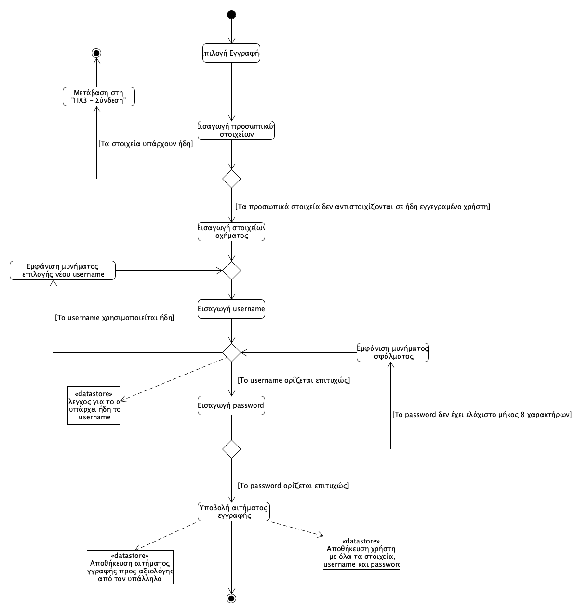
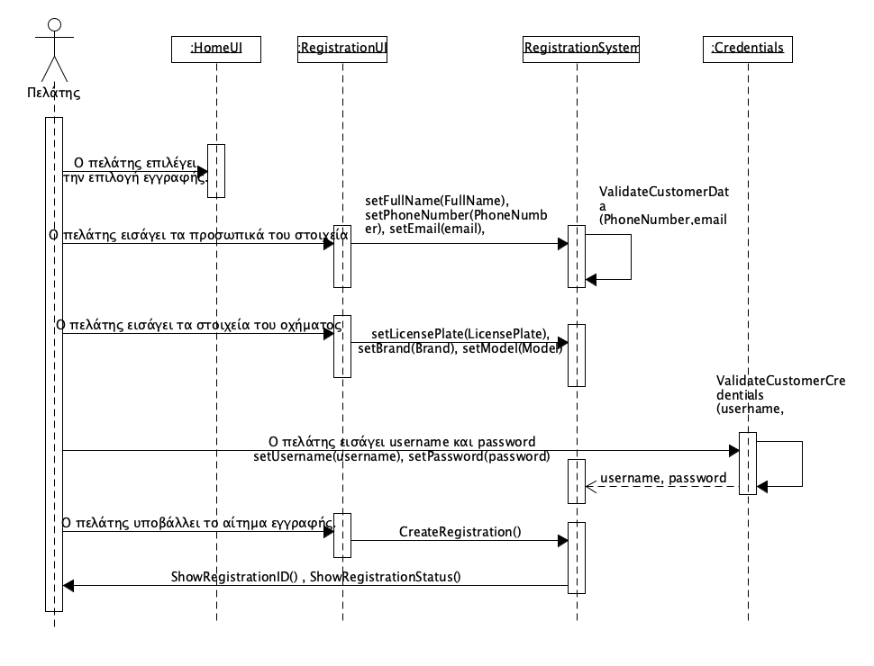

## ΠΧ1. Αίτημα εγγραφής 
- **Πρωτεύων Actor:** Πελάτης 
  
**Ενδιαφερόμενοι:** 
- **Πελάτης:** Θέλει να καταχωρήσει τα στοιχεία του και του οχήματός του στην εφαρμογή. 
  
**Προϋποθέσεις:** Ο πελάτης να έχει εγκαταστήσει την εφαρμογή και να βρίσκετε στο περιβάλλον της εφαρμογής.

## Βασική Ροή 
1. Ο πελάτης επιλέγει την επιλογή εγγραφής. 
2. Ο πελάτης εισάγει τα προσωπικά του στοιχεία (ονοματεπώνυμο, διεύθυνση, αριθμός τηλεφώνου, email). 
3. Ο πελάτης εισάγει τα στοιχεία του οχήματος (αριθμός πινακίδας, μάρκα, μοντέλο). 
4. Ο πελάτης εισάγει ένα επιθυμητό username και password για την είσοδο στην εφαρμογή.
5. Ο πελάτης υποβάλλει το αίτημα εγγραφής.
   
 ## Εναλλακτικές Ροές
*2α. Τα προσωπικά στοιχεία (αριθμός τηλεφώνου, email) που καταχωρεί ο χρήστης  αντιστοιχίζονται ήδη σε λογαριασμό.*
1. Το σύστημα εμφανίζει μύνημα σφάλματος "Υπάρχων λογαριασμός!" και ενημερώνει τον χρήστη για την ύπαρξη λογαριασμού με τα ίδια στοιχεία.
2. Το σύστημα τον μεταφέρει στην αρχικη οθόνη και ο χρήστης θα επιλέγει ανάμεσα σε "Εγγραφή" και ["Σύνδεση"](uc3-signin.md).

*4α. Το username που επέλεξε ο πελάτης χρησιμοποιείται ήδη από άλλον χρήστη.*
1. Το σύστημα εμφανίζει μύνημα σφάλματος "Υπάρχον username. Παρακαλώ επιλέξτε άλλο." και τον προτρέπει να εισάγει διαφορετικό username.

*4β. Το password δεν πληροί τις προυποθέσεις(Ελάχιστο μήκος 8 χαρακτήρων).*
1. Το σύστημα εμφανίζει μύνημα σφάλματος "Αδύναμο password. Επιλέξτε ξανά με ελάχιστο μήκος 8 χαρακτήρων." και τον προτρέπει να εισάγει password που να πληρεί τις προϋποθέσεις.

### **Διάγραμμα δραστηριότητας για σενάριο χρήσης "Αίτημα εγγραφής" **

### **Διάγραμμα ακολουθίας για σενάριο χρήσης "Αίτημα εγγραφής"**
