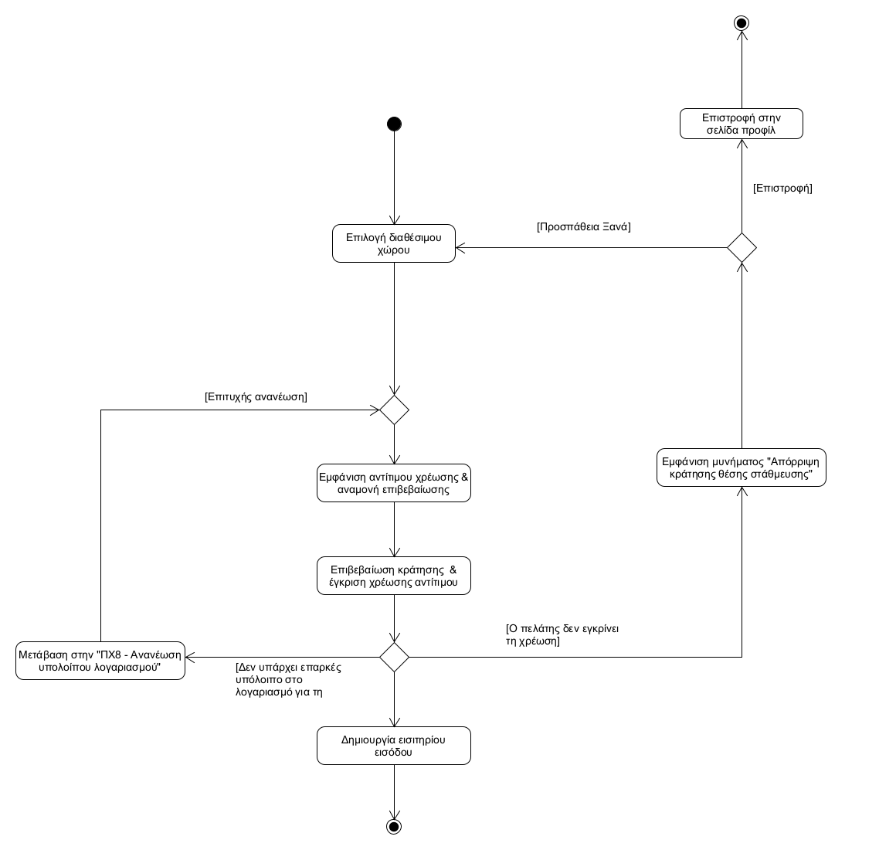
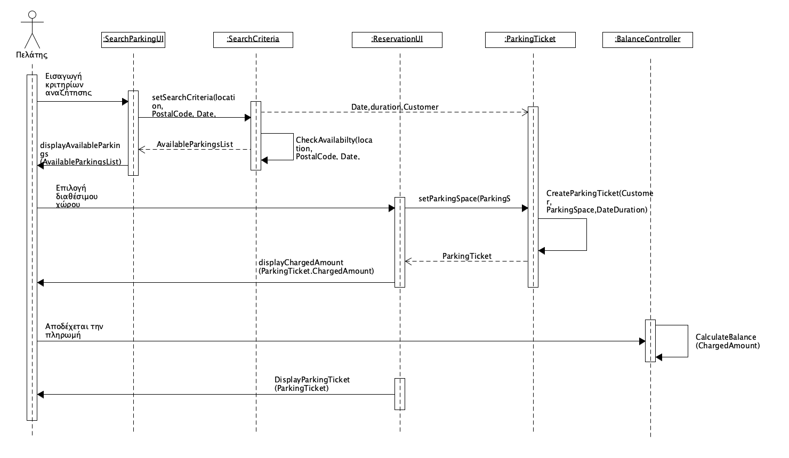

## ΠΧ5. Κράτηση θέσης στάθμευσης 
- **Πρωτεύων Actor:** Πελάτης 
  
**Ενδιαφερόμενοι:**
- **Πελάτης:** Θέλει να κάνει κράτηση μιας θέσης στάθμευσης για συγκεκριμένο χρονικό διάστημα και να εξοφλήσει το αντίστοιχο αντίτιμο.

**Προϋποθέσεις:** 
- Ο πελάτης να έχει εγγραφεί και να είναι συνδεδεμένος στην εφαρμογή.
- Ο πελάτης να έχει εκτελέσει αναζήτηση χώρων στάθμευσης

## Βασική Ροή 
1. Ο πελάτης επιλέγει έναν από τους χώρους στάθμευσης με διαθέσιμες θέσεις.
2. Το σύστημα υπολογίζει και εμφανίζει το αντίτιμο στον πελάτη, αναμένοντας επιβεβαίωση της κράτησης και έγκριση πληρωμής.
3. Ο πελάτης επιβεβαιώνει τη κράτηση και εγκρίνει τη χρέωση του αντίτιμου στον λογαριασμό του.
4. Το σύστημα δημιουργεί ένα εισιτήριο εισόδου για τον πελάτη με τις πληροφορίες της κράτησης του.

## Εναλλακτικές Ροές # 

*4α. Η χρέωση στον λογαριασμό του πελάτη αποτυγχάνει λόγω ανεπαρκούς υπολοίπου στον λογαριασμό του.* 
1. Μετάβαση στην Ανανέωση υπολοίπου λογαριασμού [ΠΧ8](uc8-manage-account-balance.md).
2. Επιστροφή στο βήμα 3 της Βασικής Ροής 

*4β. Ο πελάτης δεν εγκρίνει την χρέωση του λογαριασμού του*
1. Το σύστημα εμφανίζει μύνημα σφάλματος στον πελάτη "Απόρριψη κράτησης θέσης στάθμευσης.".
2. Επιλέγει ανάμεσα σε "Πρσπάθεια Ξανά" και "Επιστροφή".
   1. Επιλέγει "Προσπάθεια Ξανά".
      1. Η περίπτωση χρήσης επιστρέφει στο Βήμα 1 της Βασικής Ροής.
   2. Επιλέγει "Επιστροφή".
      1. Τον επιστρέφει στην σελίδα προφίλ.

### **Διάγραμμα δραστηριότητας για σενάριο χρήσης "Κράτηση θέσης στάθμευσης"**

### **Διάγραμμα ακολουθίας για σενάριο χρήσης "Κράτηση θέσης στάθμευσης"**

