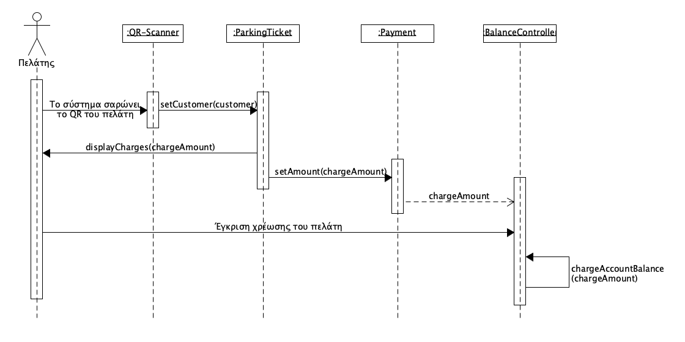

## ΠΧ7. Έξοδος οχήματος
- **Πρωτεύων Actor:** Πελάτης

**Ενδιαφερόμενοι:** 
- **Πελάτης:** Θέλει να εξέλθει από τον χώρο στάθμευσης και να εξοφλήσει το αντίτιμο της στάθμευσης. 
  

 **Προϋποθέσεις:** 
 - Ο πελάτης να έχει σταθμεύσει το όχημά του στον χώρο στάθμευσης. 

 ## Βασική Ροή 
 1. Ο πελάτης καταφθάνει στην έξοδο του χώρου και προβάλλει τον κωδικό QR του. 
 2. Το σύστημα σαρώνει τον QR κωδικό και ελέγχει την εγκυρότητα του.
 3. Το σύστημα υπολογίζει το αντίτιμο χρέωσης και το εμφανίζει στον πελάτη.
 4. Ο πελάτης εγκρίνει ή απορρίπτει τη χρέωση του αντίτιμου στο υπόλοιπο του λογαριασμού του.
 5. Ο πελάτης εξέρχεται, μετά την ολοκλήρωση της χρέωσης. 

## Εναλλακτικές Ροές
*2α. Ο κωδικός QR δεν αντιστοιχίζεται σε λογαριασμό στο σύστημα*
1. Το σύστημα εμφανίζει μύνημα σφάλματος στον πελάτη "Μη έγκυρος κωδικός QR εξόδου".
2. Επιστροφή στο βήμα 2.
   
*4α. Η χρέωση στον λογαριασμό του πελάτη αποτυγχάνει λόγω ανεπαρκούς υπολοίπου στον λογαριασμό του.* 
1. Ο πελάτης επιλέγει να ανανεώσει το υπόλοιπο του [(ΠΧ8)](uc8-manage-account-balance.md).
2. Επιστροφή στο βήμα 4 της Βασικής Ροής.

*4β. Ο πελάτης δεν εγκρίνει την χρέωση του λογαριασμού του*
1. Το σύστημα εμφανίζει μύνημα σφάλματος στον πελάτη "Δεν επιτρέπεται η έξοδος από τον χώρο πριν την πληρωμή του αντίτιμου χρέωσης".
2. Επιστροφή στο βήμα 4 της Βασικής Ροής.

### **Διάγραμμα δραστηριότητας για σενάριο χρήσης "Έξοδος οχήματος"**

### **Διάγραμμα ακολουθίας για σενάριο χρήσης "Έξοδος οχήματος"**
