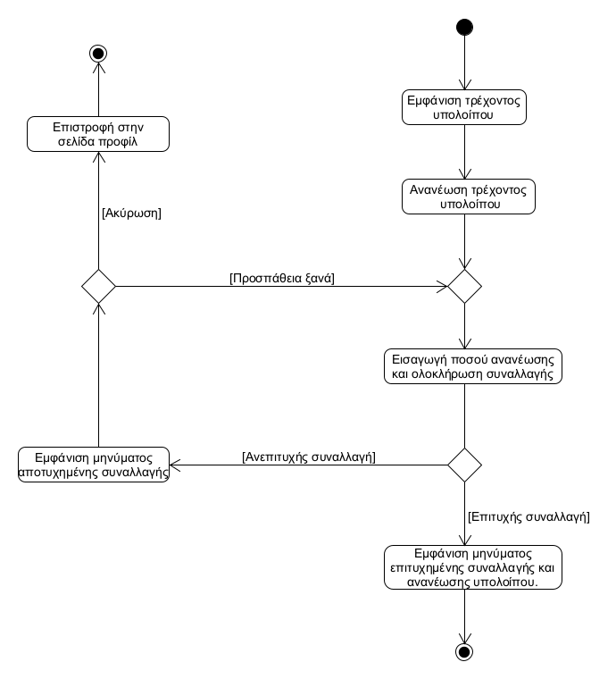
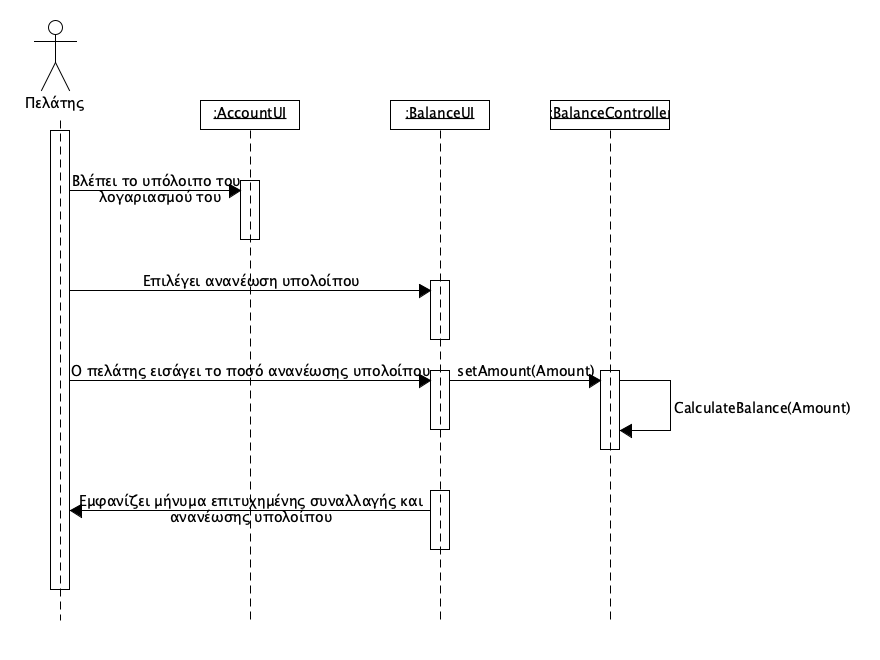

## ΠΧ8. Διαχείριση υπόλοιπου λογαριασμού 
- **Πρωτεύων Actor:** Πελάτης 

 **Ενδιαφερόμενοι:**
- **Πελάτης:** Θέλει να ανανεώνει το υπόλοιπο του λογαριασμού του για να έχει διαθέσιμο υπόλοιπο για στάθμευση. 

 **Προϋποθέσεις:** 
 - Ο πελάτης να είναι εγγεγραμένος και συνδεδεμένος στην εφαρμογή.
 
## Βασική Ροή
1. Ο πελάτης βλέπει το τρέχον υπόλοιπο του λογαριασμού του.
2. Ο πελάτης διαλέγει την επιλογή ανανέωσης υπολοίπου.
3. Ο πελάτης εισάγει το ποσό ανανέωσης και ολοκληρώνει τη συναλλαγή.
4. Η εφαρμογή εμφανίζει μήνυμα επιτυχημένης συναλλαγής και ανανέωσης υπολοίπου.

## Εναλλακτικές Ροές   
*3α. Ο πελάτης δεν έχει επαρκές υπόλοιπο στο τραπεζικό λογαριασμό του.*
1. Η εφαρμογή εμφανίζει μήνυμα αποτυχημένης συναλλαγής.
2. Επιλέγει ανάμεσα σε "Πρσπάθεια Ξανά" και "Ακύρωση".
   1. Επιλέγει "Προσπάθεια Ξανά".
      1. Η περίπτωση χρήσης επιστρέφει στο Βήμα 2 της Βασικής Ροής.
   2. Επιλέγει "Ακύρωση".
      1. Τον επιστρέφει στην σελίδα προφίλ.

## Διαγράμματα

### **Διάγραμμα δραστηριότητας για σενάριο χρήσης "Διαχείριση υπόλοιπου λογαριασμού"**

### **Διάγραμμα ακολουθίας για σενάριο χρήσης "Διαχείριση υπόλοιπου λογαριασμού"**
 